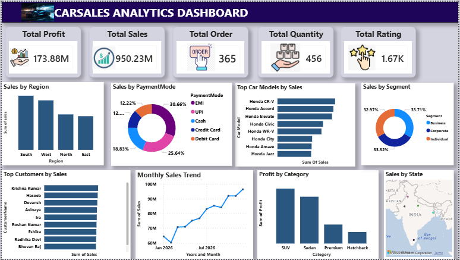

# Car Sales Analytics Dashboard

An interactive Power BI dashboard built on SQL data to analyze car sales performance.

## Tools Used
SQL, Power BI, DAX, Power Query

## Key Metrics
- Total Sales: 950.23M
- Total Profit: 173.88M
- Total Orders: 365
- Total Quantity: 456

## Key Insights
- South is the top sales region
- Honda CR-V is the top-selling car model
- EMI is the leading payment mode (30.66% of sales)
- SUV is the most profitable category

## Dashboard Includes
- 5 KPI cards and 8 visuals
- Sales by region, payment mode, segment, and state
- Top car models and top customers by sales
- Monthly sales trend and profit by category

## Dashboard Preview

